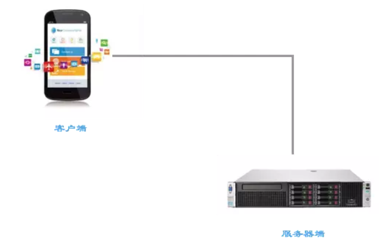

## 一只编程小白

现在的人们，每天在使用着各种手机app或网页之类的，进行日常工作，亦或是打发闲暇时间？但是在使用它们的时候，你是否曾有过一丁点的好奇心，想过这些东西到底是什么，是怎么来的？

今天，我要来给大家稍稍的科普一下这方面的知识。

## 软件是谁制作的
在这个星球上，生活着一群神秘的有机生命物种，他们中大多数作息时间是：起的比鸡早，睡的比鸡晚。他们不太善于使用祖先传下来的母语进行同族之间的沟通，却发明了各式各样的语言，和电子无机生命体进行着沟通，并以此为乐。更甚者，他们中的很多成员，成为了某种无机体语言的激进崇拜者，分门立派，并且坚定的认为：非我语类，其心必异，必须骂死丫的！

尽管如此，和他们相处的时候，你大可放心。只要不涉及到无机体语言的事情，他们还是一种比较温和的生物。

这种生物，就是我们俗称的“程序猿”，也叫软件工程师。

我们使用的各种电脑软件，网站，手机app等，都是程序猿们和各种无机体（电脑，手机等）进行沟通后的产物，它们其实就是这些懂无机体语言的程序猿设计出来的一种辅助工具，这样一来，那些即使不懂无机体语言的人群，也能通过它们很容易的去操纵电脑、手机等完成一些事情。

## 什么是编程
程序猿制作这些电脑软件、网站、app的过程，就叫做编程，也叫软件开发。

编程，其实就是在编写一份工作流程清单，在这份清单中，程序猿要非常详细的写下需要电脑做的每一件事情，每一个步骤。当你运行你电脑上的一个软件，或者是手机中的一个app的时候，实际上，你的电脑或手机就是在运行一份这样的清单，按照程序猿们事先编制好的步骤，一步一步的运行着。

## 客户端和服务器端
以前的软件程序，比较简单，一般都是在你的电脑上安装一下就可以了，运行的时候，也只是在你的电脑上运行着。但是随着历史的变迁，随着网络技术的发展，你电脑或手机上的软件运行的时候，它们其实不再只是在你的这些设备上运行了，而是被拆分，有可能在2个地方运行，也有可能在200个地方运行。运行在你电脑或手机上的那部分，也许是整个软件中不那么重要的部分而已。

运行在你的电脑或手机中的那部分，我们叫做“客户端”，它是提供一个比较形象的界面，让你和你的设备/软件进行对话：你可以通过这个界面下达命令，或者当软件做完事情后它会展现给你结果。

还有一个“服务器端”，是你平常情况下完全感觉不到的东西。也许只有在断网的情况下，你看到你的客户端提示的“服务器连接失败”之类的信息，你才会隐约感受到它的一点点存在。其实，它才是一个软件系统中的那个大BOSS，大核心。比如一个聊天软件:

你所有的好友列表，都由服务器端在存储和处理；
你所有的聊天信息，都会先发送到服务器端，然后再通过服务器端，转发到你的目标好友的电脑或手机客户端上；
你的朋友圈视频和图片，好友评论和点赞信息，它们统统都会经由服务器端的处理；
等等等等...
搭建和开发一个完善的服务器端，是个大工程。而且很多时候被不知道的人所忽略。所以，千万别在你程序猿朋友面前，说什么你想开发一个模仿XX的app，要求x天x千块完成，我想，你朋友的内心一定是想甩你几个响亮的大嘴巴子的。

## 哪些地方需要编程
随着计算机技术的发展，越来越多的地方可以进行编程，你身边充斥着被编程过的东西，电脑、手机、汽车、电视机、空调、冰箱、手表、眼镜......掌握编程，就是掌握了未来的主动权（哈哈哈，希望是这样吧）。